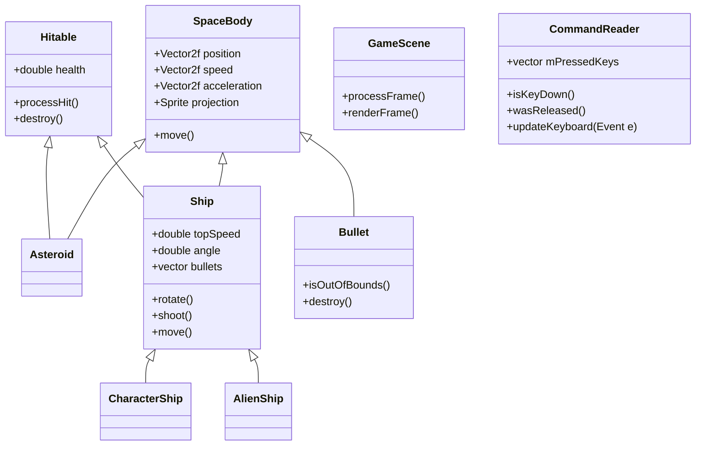
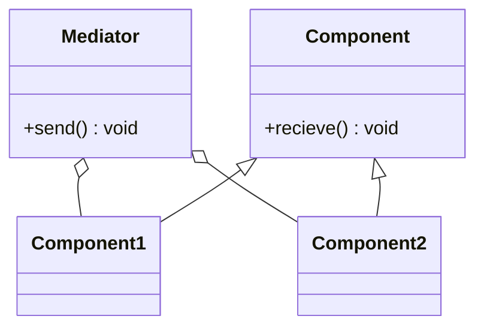

#	Опять вы со своим ООП пристали

* toc
{:toc}

##	STUPID/SOLID

####	Что такое STUPID и как с ним бороться?

- **Синглтон**

  Не допускайте ситуаций:

  - глобальные объекты могут быть вредны для объектного программирования, в некоторых случаях приводят к созданию немасштабируемого проекта;
  - усложняется контроль за межпоточными гонками и задержками.

- **Сильная Связанность/Tight Coupling**

  Старайтесь избегать в вашем коде ЛЮБЫХ глобальных переменных, а также зависимостей одной части кода от другой.

- **Невозможность тестирования**

  Ваш код должен быть легко тестируемым. В большинстве случаев невозможность тестирования вызвана сильной связанностью.

- **Преждевременная оптимизация**

  Если вам кажется, что какой-то кусок кода можно сильно “упростить”,  то подумайте об этом двважды. Возможно, этим упрощением вы усложните себе потом жизнь или вообще сами себя запутаете.

- **Не дескриптивное присвоение имени**

  Надеюсь, что тут все уже все знают без комментариев.

- **Дублирование кода ОСТОРОЖНО КОПИПАСТА**

  Если вы видите, что у вас больше одного раза встречается кусок кода длиной больше 4 строчек, ПОЖАЛУЙСТА, вынесите его в отдельный метод/функцию.

####	SOLID

- **Принцип единственной обязанности**

  Принцип единственной обязанности (Single-Responsibility Principle, SRP) гласит, что на каждый класс должна быть возложена одна-единственная обязанность. Если начинаете писать комментарии такие как **in this case, but if, except when, or,** то вы делаете это неправильно.

- **Принцип открытости/закрытости**

  Сущности (классы, модули, функции и т.п.) должны быть открытыми для расширения, но закрытыми для модификации. Вы должны сделать все переменные экземпляра **private** по умолчанию. Пишите методы get и set только, когда они действительно будут вам нужны.

- **Принцип подстановки Барбары Лисков**

   Должна быть возможность вместо базового типа подставить любой его подтип.

- **Принцип разделения интерфейса**

  Много специализированных интерфейсов лучше, чем один универсальный.

- **Принцип инверсии зависимостей**

  Абстракции не должны зависеть от деталей (реализации системы), но детали должны зависеть от абстракций.
  Модули верхних уровней не должны зависеть от модулей нижних уровней. Оба типа модулей должны зависеть от абстракций.

##	Объектная модель

Если решили написать какой-либо проект, первым делом необходимо не открыть среду разработки и начать писать что-либо, а сесть где-то с чайком и бумажкой и подумать, какие сущности будут вам необходимы. Помните о принципах SUPID/SOLID, в первую очередь о разделении обязанностей. После этого подумайте о том, что ваши сущности должны уметь, как они должны между собой взаимодействовать. После этого переходите к следующему шагу, построению UML-диаграммы.

##	UML

UML-диаграмма - схема вашей объектной модели. Приведем пример:


## Design patterns

###	[Update Method](http://gameprogrammingpatterns.com/update-method.html)

Давайте вспомним, как мы писали платформер с прыгающим человечком, игру мемори, автомат. Что общего было между всеми этими проектами?


Если немножко подумать, то окажется, что во всех этих проектах был метод, который назывался как-то похоже на processFrame() и отвечал за изменения нашей модели на каждом кадре/итерации. Это и есть пример паттерна Update Method!

Этот паттерн заключается в том, что мы выносим обработку изменения наших персонажей/всего поля в отдельные методы для того, чтобы наш код был более читабельым и понятным в использовании.

```C++
class Entity {
public:
  Entity()
  : x_(0), y_(0)
  {}

  virtual ~Entity() {}
  virtual void update() = 0;

  double x() const { return x_; }
  double y() const { return y_; }

  void setX(double x) { x_ = x; }
  void setY(double y) { y_ = y; }

private:
  double x_;
  double y_;
};

class World
{
public:
  World()
  : numEntities_(0)
  {}

  void gameLoop() {
  while (true)
  {
    // Handle user input...

    // Update each entity.
    for (int i = 0; i < numEntities_; i++)
    {
      entities_[i]->update();
    }

    // Physics and rendering...
  }
}

private:
  Entity* entities_[MAX_ENTITIES];
  int numEntities_;
};
```


###	[Flyweight](http://gameprogrammingpatterns.com/flyweight.html)


Например, вы решили написать игру, где какой-то герой стреляет пульками в другого героя, но пульки очень красивые, у них есть своя текстурка. Вы понимаете, что одновременно у вас на экране находится очень много пулек.

```C++
class Bullet {
public:
	Bullet() {
		mTexture.loadFromFile("texture.png");
		mSprite.setTexture(mTexture);
	}
private:
	sf::Texture mTexture;
	sf::Sprite mSprite;
}

int main() {
	Bullet bullets[100];
}

```

Что может быть не так с этим кодом?


Логично, что храня для каждой пульки отдельную тукстуру, мы занимаем в результате очень много памяти, хотя могли бы этого не делать, ведь все текстуры у нас одинаковые. Это наводит нас на мысль, что хранить можно всего одну текстурку, передавая ее каждой пуле.

```c++
enum TEXTURES {
	BULLET_TEXTURE,
	CHARACTER_TEXTURE,
	SHIP_TEXTURE
}

class Bullet {
public:    
    Bullet(Texture* texture) {
        mTexture = texture;
    }
private:
    Texture* mTexture;
    Sprite mSprite;
}

class GameScene {
    GameScene() {
        mTextures.resize(3);
        mTextures[0].loadFromFile("bullet.png");
        mTextures[1].loadFromFile("character.png");
        mTextures[2].loadFromFile("ship.png");
    }
    void createBullet() {
        mBullets.append(Bullet(mTextures[BULLET_TEXTURE]));
    }
private:
    vector<Texture> mTextures;
    vector<Bullet> mBullets;
}
```

###	[Command](http://gameprogrammingpatterns.com/command.html)

Патерн, который превращает запросы в объекты, позволяя передавать их как аргументы при вызове методов.

```C++
void InputHandler::handleInput()
{
  if (isButtonPressed(BUTTON_X)) jump();
  else if (isButtonPressed(BUTTON_Y)) fireGun();
  else if (isButtonPressed(BUTTON_A)) swapWeapon();
  else if (isButtonPressed(BUTTON_B)) lurchIneffectively();
}
```

В чем здесь бага? А если кнопок станет 10? А 15? А если мы решим поменять кнопки у действий? Кажется, все это сильно затруднит понимание кода и его читабельность.


Решение: 

Почему бы нам не создать интерфейс с методом execute(), от которого мы будем наследовать все наши классы, отчечающие за каждое из действий.

```C++
class Command
{
public:
  virtual ~Command() {}
  virtual void execute() = 0;
};

class JumpCommand : public Command
{
public:
  virtual void execute() { jump(); }
};

class FireCommand : public Command
{
public:
  virtual void execute() { fireGun(); }
};
```

Теперь каждый из наших классов имеет один и тот же метод execute(), реализованный по-разному, что позволяет нам оперировать одинаково с каждой из команд.

```C++
class InputHandler
{
public:
  void handleInput() {
  if (isPressed(BUTTON_X)) buttonX_->execute();
  else if (isPressed(BUTTON_Y)) buttonY_->execute();
  else if (isPressed(BUTTON_A)) buttonA_->execute();
  else if (isPressed(BUTTON_B)) buttonB_->execute();
}

private:
  Command* buttonX_;
  Command* buttonY_;
  Command* buttonA_;
  Command* buttonB_;
};
```

Таким образом, представленный паттерн убирает прямую зависимость между объектами, вызывающими операции, и объектами, которые их непосредственно выполняют.

###	[Mediator](https://refactoring.guru/ru/design-patterns/mediator)

Позволяет передвавать информацию между разными компонентами, избегая сильной связности.
Достигает этого через броадкаст сообщения, всем компонентам, которые с ним связаны.




```c++
class ContainerObject
{
public:
  void send(int message)
  {
    for (int i = 0; i < MAX_COMPONENTS; i++)
    {
      if (components_[i] != NULL)
      {
        components_[i]->receive(message);
      }
    }
  }

private:
  static const int MAX_COMPONENTS = 10;
  Component* components_[MAX_COMPONENTS];
};
```


###	[State](http://gameprogrammingpatterns.com/state.html)

Патерн позволяющий описывать поведение вашего объекта с помощью **конечного автомата**.

Задача: Героиня должна уметь прыгать.

```c++
void Heroine::handleInput(Input input)
{
    if (input == PRESS_B)
    {
        yVelocity_ = JUMP_VELOCITY;
        setGraphics(IMAGE_JUMP);
    }
}
```

В чем здесь бага?

Задача: Героиня должна уметь прыгать и приседать.

```c++
void Heroine::handleInput(Input input)
{
    if (input == PRESS_B)
    {
        // Jump if not jumping...
    }
    else if (input == PRESS_DOWN)
    {
        if (!isJumping_)
        {
            setGraphics(IMAGE_DUCK);
        }
    }
    else if (input == RELEASE_DOWN)
    {
        setGraphics(IMAGE_STAND);
    }
}
```

В чем здесь бага?

Решение:

```c++
void Heroine::handleInput(Input input)
{
    if (input == PRESS_B)
    {
        if (!isJumping_ && !isDucking_)
        {
            // Jump...
        }
    }
    else if (input == PRESS_DOWN)
    {
        if (!isJumping_)
        {
            isDucking_ = true;
            setGraphics(IMAGE_DUCK);
        }
    }
    else if (input == RELEASE_DOWN)
    {
        if (isDucking_)
        {
            isDucking_ = false;
            setGraphics(IMAGE_STAND);
        }
    }
}
```


Вывод: при дальнейшем наращивании функционала количество ифаний и флагов делает код абсолютно нечитабельным. В довесок появляются невозможные комбинации `(isDucking_ == isJumping_ = true)`.


Очевидным решением будет **enum**. Тут еще была добавлена возможность “нырка” в прыжке.

```c++
enum State
{
    STATE_STANDING,
    STATE_JUMPING,
    STATE_DUCKING,
    STATE_DIVING
};

void Heroine::handleInput(Input input)
{
    switch (state_)
    {
        case STATE_STANDING:
            if (input == PRESS_B)
            {
                state_ = STATE_JUMPING;
                yVelocity_ = JUMP_VELOCITY;
                setGraphics(IMAGE_JUMP);
            }
            else if (input == PRESS_DOWN)
            {
                state_ = STATE_DUCKING;
                setGraphics(IMAGE_DUCK);
            }
            break;

        case STATE_JUMPING:
            if (input == PRESS_DOWN)
            {
                state_ = STATE_DIVING;
                setGraphics(IMAGE_DIVE);
            }
            break;

        case STATE_DUCKING:
            if (input == RELEASE_DOWN)
            {
                state_ = STATE_STANDING;
                setGraphics(IMAGE_STAND);
            }
            break;
    }
}
```


Проблемы опять начинают появляться, если мы захотим добавить зависимость силы удара от времени, которое персонаж будет приседать. Необходимо отслеживать время заряда удара.

```c++
void Heroine::update()
{
    if (state_ == STATE_DUCKING)
    {
        chargeTime_++;
        if (chargeTime_ > MAX_CHARGE)
        {
            superBomb();
        }
    }
}

void Heroine::handleInput(Input input)
{
    switch (state_)
    {
        case STATE_STANDING:
            if (input == PRESS_DOWN)
            {
                state_ = STATE_DUCKING;
                chargeTime_ = 0;
                setGraphics(IMAGE_DUCK);
            }
            // Handle other inputs...
            break;

            // Other states...
    }
}
```


Его величество **States**.

```c++
class HeroineState
{
    public:
    virtual ~HeroineState() {}
    virtual void handleInput(Heroine& heroine, Input input) {}
    virtual void update(Heroine& heroine) {}
};


class DuckingState : public HeroineState
{
    public:
    DuckingState()
        : chargeTime_(0)
        {}

    virtual void handleInput(Heroine& heroine, Input input) {
        if (input == RELEASE_DOWN)
        {
            // Change to standing state...
            heroine.setGraphics(IMAGE_STAND);
        }
    }

    virtual void update(Heroine& heroine) {
        chargeTime_++;
        if (chargeTime_ > MAX_CHARGE)
        {
            heroine.superBomb();
        }
    }

    private:
    int chargeTime_;
};


class Heroine
{
    public:
    virtual void handleInput(Input input)
    {
        state_->handleInput(*this, input);
    }

    virtual void update()
    {
        state_->update(*this);
    }

    private:
    HeroineState* state_;
};
```

С этого момента можно выбрать разные способы хранения объектов состояний (статические поля/создание при надобности). Такж же следует озадачится тем, как же эти состояния переключать между собой.

```c++
void Heroine::handleInput(Input input)
{
    HeroineState* state = state_->handleInput(*this, input);
    if (state != nullptr)
    {
        delete state_;
        state_ = state;
    }
}

HeroineState* StandingState::handleInput(Heroine& heroine, Input input)
{
    if (input == PRESS_DOWN)
    {
        // Other code...
        return new DuckingState();
    }

    // Stay in this state.
    return nullptr;
}
```


##	ДЗ

**Составить объектную модель по заданному фрагменту текста. Привести UML диаграмму классов, которая должна содержать иерархию наследований, описание методов и полей.**

https://app.creately.com/diagram/create

https://www.draw.io/

Тогда он бросил две шишки сразу и стал ждать, какая из них выплывет первой. И одна из них выплыла первой, но, так как они были одинакового размера, Пух. не знал, была ли это та, которую он задумал, или другая. Тогда в следующий раз он бросил одну большую, а другую маленькую, и большая выплыла первой, как он и думал, а маленькая выплыла последней, как он тоже думал, так что он выиграл два раза!.. И к тому времени, когда Винни пошел домой пить чай, он уже выиграл тридцать шесть раз и проиграл двадцать восемь. Иными словами, он выиграл... Ну, отнимите сами двадцать восемь от тридцати шести, и вы узнаете, сколько раз он выиграл. Или - сколько раз он проиграл, если это вам интереснее.

321525555551121

Для желающих делать проекты необходимо дополнительно составить объектную модель **самой простой** версии.

##	Можно почитать

http://gameprogrammingpatterns.com/contents.html

https://habr.com/ru/post/150041/

https://habr.com/ru/post/87205/

https://habr.com/ru/post/438510/

https://m.habr.com/ru/post/210288/

https://javarush.ru/groups/posts/uml-v-java

[https://ru.wikipedia.org/](https://ru.wikipedia.org/wiki/Диаграмма_классов)
